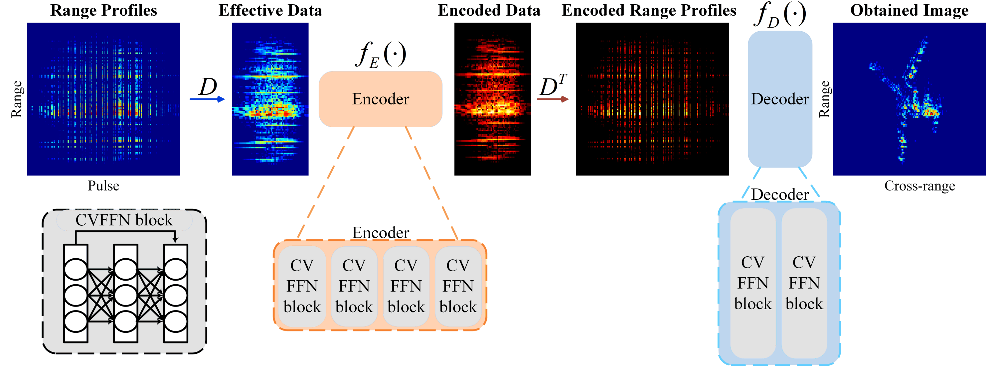

# CVAE-pytorch
Pytorch implementation of CVAE, with simple annotation
>CVAE: An Efficient and Flexible Approach for Sparse Aperture ISAR Imaging
[CVAE full paper](https://ieeexplore.ieee.org/abstract/document/10006814)

## Abstract 
The use of traditional compressed sensing methods in sparse aperture inverse synthetic aperture radar (SA-ISAR) imaging suffers from high computational burdens and complicated formula derivations. To solve these problems, a complex-valued autoencoder (CVAE) architecture trained to efficiently obtain ISAR images from incomplete echoes is proposed in this Letter. In addition, a training set is generated for network training via self-supervised learning. Instead of using multiple simulated scenes as a training set, multiple range cells in a simulated scene are used based on two considerations. First, reducing the complexity of the dataset allows for faster and easier training of the network. Second, it is flexible as it does not require retraining when handling scenes with various numbers of range cells. In this way, due to the properties of matrix operations, similar time complexity can be achieved in both single measurement vector (SMV) and multiple measurement vector (MMV) cases. Notably, the network can be trained using only the training set and tested on the simulated electromagnetic (EM) data and the data obtained from an operational radar system. Our experimental results validate the superiority of the proposed method in terms of better performance, better robustness to noise, and higher computational efficiency.

## Architecture
The flowchart for the whole architecture of CVAE:


## Citation
Please use the following bibtex entry:
```
@ARTICLE{CVAE,
  author={Wang, Jianyang and Li, Shiyuan and Cheng, Di and Zhou, Lingyun and Chen, Chang and Chen, Weidong},
  journal={IEEE Geoscience and Remote Sensing Letters}, 
  title={CVAE: An Efficient and Flexible Approach for Sparse Aperture ISAR Imaging}, 
  year={2023},
  volume={20},
  number={},
  pages={1-5},
  doi={10.1109/LGRS.2023.3234432}}
```
## License
[MIT](./LICENSE)
